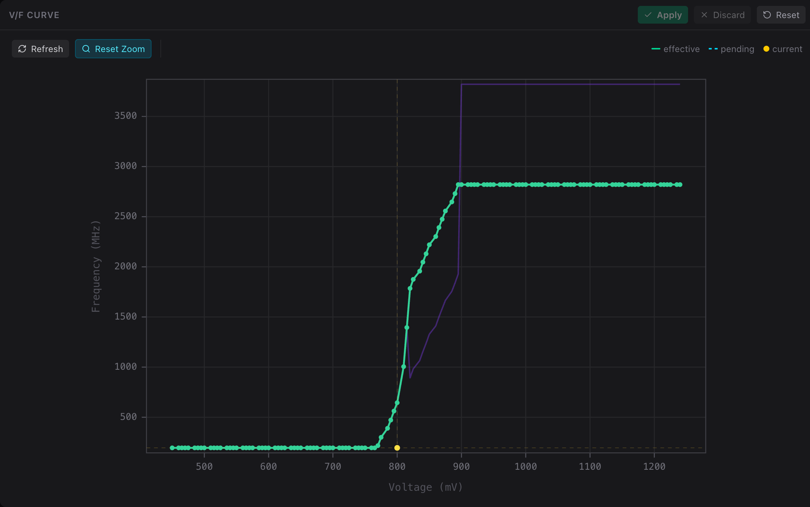
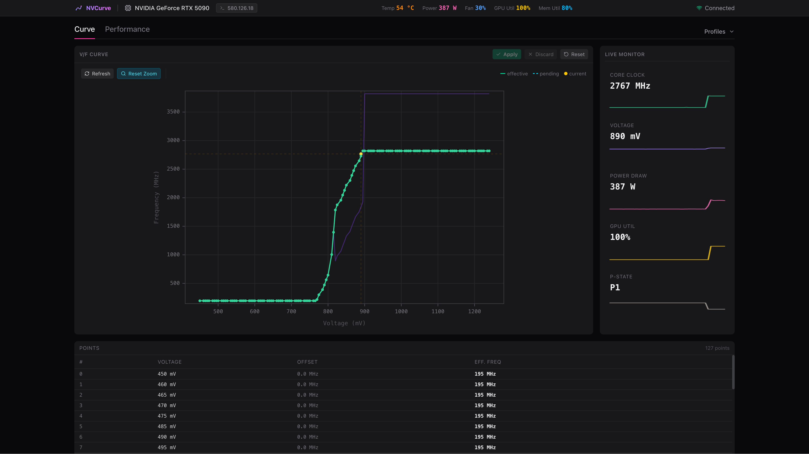

<div align="center">
  
  <h1>NVCurve</h1>
  <p><strong>Linux NVIDIA GPU V/F Curve Editor & OC Tool</strong></p>
</div>

---

NVCurve brings MSI Afterburner-style per-point voltage-frequency curve control to Linux. It calls undocumented NvAPI functions directly via `libnvidia-api.so`, giving you precise frequency offsets control. A Python CLI handles scripting and headless use; a React web UI provides interactive curve editing, profile management, and live hardware monitoring.

> [!WARNING]
> **This tool is experimental.** Verified only on an **RTX 5090** with driver **580.126.18**. Compatibility with other GPUs and driver versions is unknown. The underlying NvAPI functions are undocumented and may change or disappear between driver releases.
>
> Read operations are generally safe. Write operations alter GPU operational parameters. **Follow the first-time setup steps below before applying any changes**, and proceed with caution.



## Features

- **Per-Point Curve Editing**: Independently adjust the frequency offset for any voltage point on the GPU's V/F curve.
- **Live Monitoring**: Tracks GPU voltage, clock speed, temperature, and power draw via NvAPI and NVML.
- **Profile Management**: Save and load named clock configurations.
- **Modern Web UI**: Interactive curve graph, point table, and real-time monitoring dashboard, all in the browser.

## Prerequisites

- **OS**: Linux
- **GPU**: NVIDIA GPU (tested on RTX 5090, Blackwell architecture)
- **Python**: 3.12+
- **Privileges**: Root access is required for hardware interactions. The CLI will prompt for elevated privileges via `sudo` when needed.

## Installation

We recommend installing with [uv](https://docs.astral.sh/uv/getting-started/installation/):

```bash
uv tool install nvcurve
```

*For frontend development, use `pnpm install` and `pnpm run dev` in the `frontend/` directory.*

## Getting started

### Step 1 — Verify hardware compatibility

Before touching anything, confirm NvAPI is working correctly on your GPU and driver. **Do not skip this on an untested configuration.**

Probe all required NvAPI functions:

```bash
nvcurve read --diag
```

Every entry under `=== Function probe ===` should show `resolved`. If any critical function shows `NOT FOUND`, write operations will not work and the tool is unsupported on your system.

Read your current curve to establish a baseline:

```bash
nvcurve read
```

Run a write-and-verify cycle with a small, safe offset to confirm the write path works end-to-end:

```bash
nvcurve verify --point 80 --delta 5
```

This writes `+5 MHz` to point 80, reads it back, and confirms whether the driver accepted the change, including whether any other points were unexpectedly modified. Restore your baseline afterwards:

```bash
nvcurve snapshot restore
```

Only continue once `verify` reports success.

### Step 2 — Launch the web UI

With compatibility confirmed, the web UI is the primary interface for curve editing, monitoring, and profile management:

```bash
nvcurve
```

This starts the backend server and opens the UI in your browser at `http://localhost:8042`.



To run the server in the background:

```bash
nvcurve serve start --detach
nvcurve serve status
nvcurve serve stop
```

### Step 3 — (Optional) Install as a systemd service

If you want the server to start automatically on boot, register it as a systemd service:

```bash
nvcurve service install
```

This enables and starts the service immediately. Manage it with:

```bash
nvcurve service start
nvcurve service stop
nvcurve service restart
nvcurve service status
nvcurve service uninstall
```

## Upgrading

```bash
uv tool upgrade nvcurve
```

If you are running nvcurve as a systemd service, restart it afterwards to pick up the new version:

```bash
nvcurve service restart
```

## Web UI controls

### Curve editor

| Action | Result |
|---|---|
| Click point | Select (clears other selections) |
| Shift+click point | Add/remove point from selection |
| Ctrl/Cmd+A | Select all active points |
| Escape | Clear selection |
| Drag point | Stage a frequency offset edit |
| Drag point (multi-selection) | Moves all selected points together |
| Enter (single point selected) | Open inline input to type an exact offset |
| ↑ / ↓ arrow keys | Nudge selected point(s) ±1 MHz |
| Ctrl/Cmd + ↑ / ↓ | Nudge ±10 MHz |
| Tab / Shift+Tab | Step through points one by one |
| Shift+drag on background | Box select; draw a rubber-band rectangle |
| Drag on background | Pan the X axis |
| Alt+scroll | Zoom X axis around the cursor |

### Point table

| Action | Result |
|---|---|
| Click row | Select point |
| Ctrl/Cmd+click | Toggle point in/out of selection |
| Shift+click | Range select from last selected to clicked |
| Drag across rows | Range select by dragging |
| Select Before / Select After | Expand selection to all points before or after the currently selected one (appears when exactly one point is selected) |

### Toolbar

The **Global Offset** slider appears when all active points share a uniform delta. Dragging it stages that offset across every point simultaneously; equivalent to `nvcurve write --global` but interactive.

## CLI reference

The CLI is suited for scripting, headless systems, or quick one-off operations. All write commands support `--dry-run` to preview changes without applying them.

### Reading

```bash
nvcurve read                   # Condensed V/F curve
nvcurve read --full            # All points
nvcurve read --json            # JSON output
```

### Writing

> [!NOTE]
> If you use LACT or similar tools, disable them first. Concurrent writes will overwrite each other.

```bash
# Preview first
nvcurve write --global --delta 50 --dry-run
nvcurve write --point 80 --delta 100 --dry-run

# Apply
nvcurve write --global --delta 50
nvcurve write --point 80 --delta 100
nvcurve write --range 70-90 --delta 75
nvcurve write --reset          # Reset all offsets to 0
```

Snapshots are saved automatically before each write. Manual snapshot management:

```bash
nvcurve snapshot save
nvcurve snapshot list
nvcurve snapshot restore
```

### Profiles

```bash
nvcurve profile save --name balanced
nvcurve profile apply --name balanced
nvcurve profile list
```

### Diagnostics

```bash
nvcurve read --diag            # Probe all NvAPI functions
nvcurve inspect --point 80     # Raw buffer fields for a point
nvcurve inspect --range 78-82
```

## Architecture

NVCurve has two components:

- **Python backend (`nvcurve/`)**: Talks directly to `libnvidia-api.so` (via ctypes) and `libnvidia-ml.so` to read and write hardware state. Exposes everything through a FastAPI REST + WebSocket server, keeping privileged operations isolated from the browser.
- **React frontend (`frontend/`)**: Runs in the browser and communicates with the backend over HTTP and WebSockets. Handles curve visualization, point editing, live monitoring, and profile management.

## Disclaimer

This software is provided as-is. The NvAPI functions it relies on are undocumented, unsupported officially by NVIDIA, and may change or break without notice between driver versions. NVCurve has been verified on a single GPU (RTX 5090) and driver version (580.126.18); behaviour on other hardware is unknown. Write operations alter GPU state. The authors accept no responsibility for hardware damage, system instability, or data loss resulting from the use of this software.
